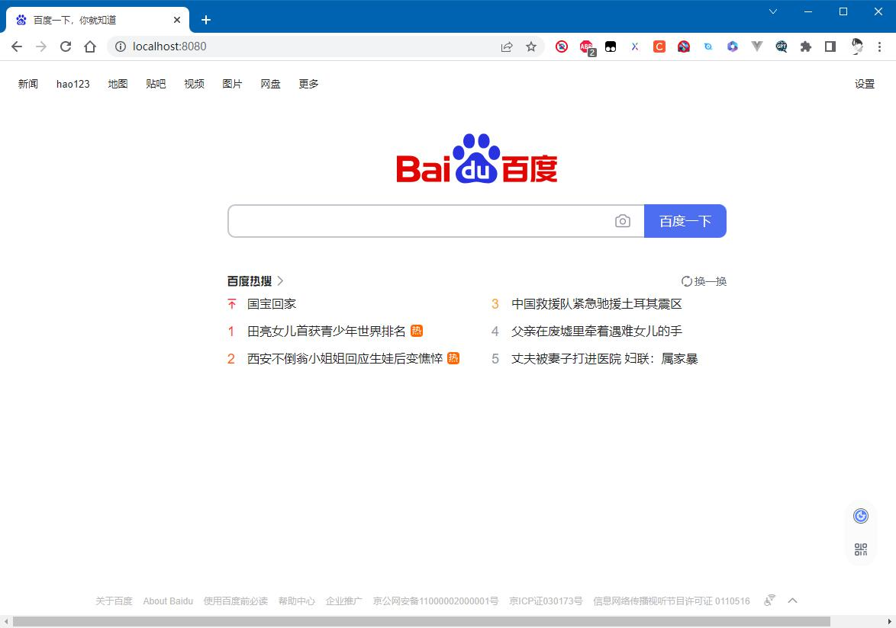

# go-http-agent
使用go语言编写的http代理程序

启动命令
```shell
go-http-agent --port 8080 --context-path / --proxy-url http://www.baidu.com
```
支持宫自定义工程名

```
go-http-agent --port 8080 --context-path /xxx --proxy-url http://www.baidu.com/yyy
```


成功反向代理百度
